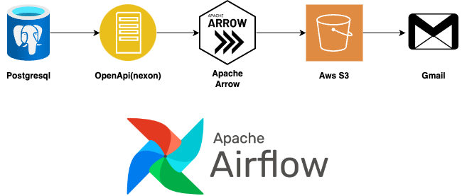

# Airflow를 이용한 데이터 파이프라인 작성

## 앞서서
- 해당 작업은 필요한 태스크를 하나 하나 만들어 가는 과정입니다.


## 1. 완성된 워크플로

- 데이터 호출 및 저장
- 데이터를 데이터베이스에 저장
- 데이터를 원하는 작업 실행


## 2. 도식



## 3. 해당 프로젝트에 포함된 요소

- 점진적 데이터 처리
- xcom
- 외부 시스템과의 연결


## 4. Airflow 테스트 환경 만들기

- 필요 패키지 설치
```
sudo apt update -y
sudo apt install python3-venv
python3 -m venv venv
source venv/bin/activate
pip install apache-airflow
pip install boto3
```
- db 초기화 및 관리자 만들기

```
airflow db init 
airflow users create --username admin --password admin --firstname Anonymous --lastname Admin --role Admin --email admin@example.org
```

- airflow 실행

```
airflow webserver
airflow scheduler
# airflow standalone 
```


## 5. 데이터 호출 태스크 만들기

```
./dag_jinja.py
get_data = PythonOperator(
    task_id="get_data_from_openapi",
    python_callable=_get_character_timeline,
    op_kwargs={"day": "{{ ds }}", "next_day": "{{ data_interval_end | ds}}"},
    dag=dag,
)
```

- 템플릿을 사용하는 것으로 멱등성, 점진적 데이터 처리 가능


## 6. 데이터 업로드 태스크 만들기

- s3에 이전 태스크가 저장한 파일 업로드

```
def _upload_s3_files(file_name, bucker_name,dest_name):

    s3_client = boto3.client(
        "s3",
        aws_access_key_id="",
        aws_secret_access_key="",
    )

    response = s3_client.upload_file(file_name, "bucket_name", dest_name)


upload = PythonOperator(
    task_id="upload_file_to_s3_2",
    python_callable=_upload_s3_files,
    op_kwargs={"file_name": "/home/ubuntu/test.txt",
     "bucket_name": "",
     "dest_name": "data/test123.txt"},
    dag=dag,
)
```


## 7. 스파크를 이용한 빅데이터 처리 / 

```
test = SparkSubmitOperator(
    task_id="spark_submit_job", application="/home/ubuntu/test_spark.py"
)
```


## 8. Email 알람 태스크 만들기

- 설정 수정
```
~/airflow/airflow.cfg

smtp_starttls = False
smtp_ssl = True
smtp_user = 이메일
smtp_password = 구글에서 받은 비밀번호 
smtp_port = 465
smtp_mail_from = 이메일
smtp_timeout = 30
smtp_retry_limit = 5
```

- EmailOperator 사용

```
./airflow_email.py
...
mailling = EmptyOperator(
    task_id="emailling",
    to="받는 사람 이메일",
    subject="[TEST] {{ds}} 테스트 메일 입니다.",
    html_content="""
                        테스트 메일입니다.<br/><br/> 
                        ninja template<br/>
                        {{ data_interval_start }}<br/>
                        {{ ds }}<br/>
                    """,
    dag=dag,
)
```

## 9. 추가 작업